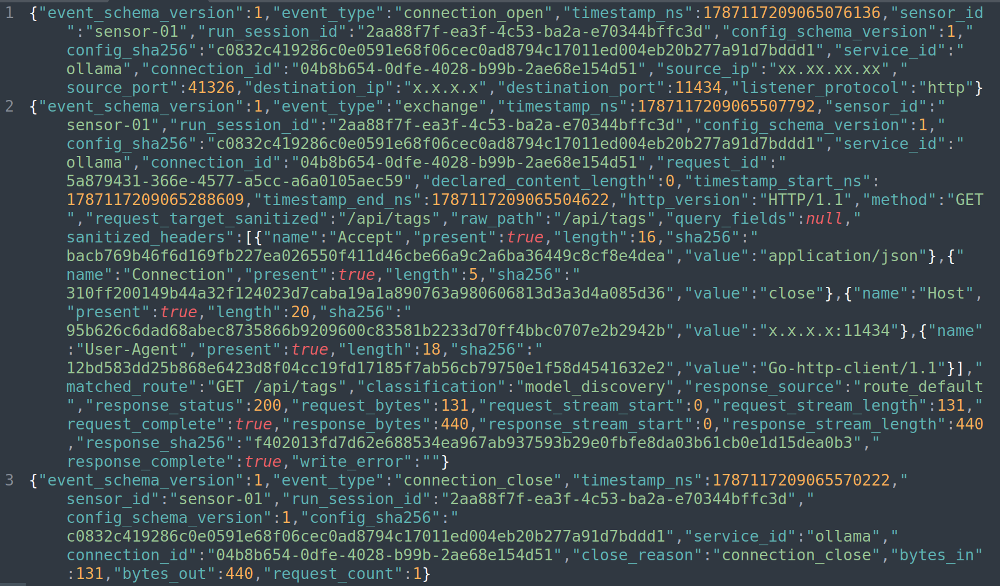

# notAIhoney

**notAIhoney** is a Linux honeypot for exposed AI inference and model-serving APIs.

It presents believable AI-service endpoints, records network and application activity, and returns synthetic responses without running a real LLM or executing attacker-controlled actions.

**Owner:** Denis Laskov  
**Year:** 2026  
**Current services:** Ollama and vLLM  
**Platform:** Ubuntu 24.04 LTS  
**License:** Free for personal use

---

## 1. What it does

The current version includes enabled and tested simulations for:

```text
Ollama  -> TCP/11434
vLLM    -> TCP/8000
```

### Ollama

Supported Ollama API routes include:

```text
GET  /api/version
GET  /api/tags
GET  /api/ps
POST /api/show
POST /api/generate
POST /api/chat
```

### vLLM

vLLM simulation is also enabled and tested on TCP/8000 using YAML-defined static responses.

As with Ollama, vLLM behavior is defined in `honeypot.yaml` and does not require product-specific Go logic.

notAIhoney records activity at several levels:

- **PCAPNG** — packet-level network evidence captured by `dumpcap`
- **BWJ** — exact application-level inbound and outbound bytes
- **JSONL** — structured forensic events
- **SQLite** — optional offline analytical index built from collected evidence

The honeypot does not execute attacker requests. It does not perform real inference, run tools or commands, download models, fetch attacker-controlled URLs, or act as an outbound proxy.

---

## 2. Prerequisites

This release is intended for an **isolated Ubuntu 24.04 LTS amd64/x86_64 host** using systemd.

Required:

- root or `sudo` access
- an active network interface available for packet capture
- `dumpcap` / Wireshark capture components
- persistent local storage for evidence
- systemd
- **UFW installed and already active**

The installer does not own the host firewall configuration. It must not enable, disable, restart, or reconfigure UFW globally.

The current Ubuntu deployment also expects native `nftables.service` **not** to be active or enabled. notAIhoney uses administrator-managed UFW for exposure of validated honeypot listener ports.

A Go compiler is **not required** when installing from a prebuilt release bundle.

---

## 3. How to install

Install the current Ubuntu 24.04 release in the following order.

### 1. Download the release archive

Download the release archive from:

```text
package/
```

### 2. Unpack the archive

Create or choose a directory for the release and extract the package:

```bash
tar -zxvf package.tar.gz
```

Then enter the extracted project directory.

### 3. Update the operating system

Before installing notAIhoney, update the package index and installed packages:

```bash
sudo apt update
sudo apt upgrade
```

### 4. Install Wireshark

Install Wireshark, which provides `dumpcap` for packet capture:

```bash
sudo apt install wireshark
```

### 5. Enter the scripts directory

```bash
cd scripts/
```

### 6. Prepare the system and configure dumpcap

Run both preparation scripts as superuser:

```bash
sudo ./prep_system.sh
sudo ./dumpcap_permissions.sh
```

`prep_system.sh` prepares the host prerequisites required by notAIhoney.

`dumpcap_permissions.sh` configures the packet-capture permissions required by the dedicated capture service.

### 7. Run the runtime installer

From the same `scripts/` directory, run:

```bash
sudo ./installer_ubuntu24_runtime.sh
```

The installer deploys the notAIhoney runtime, configuration, evidence directories, systemd services, capture configuration, listener validation, and firewall integration required by the current release.

### Cloud installations

When deploying notAIhoney in a cloud environment, update the instance or network **security group / firewall rules** to allow inbound access to the honeypot service ports you intend to expose:

```text
Ollama  -> TCP/11434
vLLM    -> TCP/8000
```

These cloud security-group rules are separate from the host firewall configuration on the Ubuntu machine.

After installation, verify the services:

```bash
sudo systemctl status notaihoney-capture.service
sudo systemctl status notaihoney.service
```

The capture service must be healthy before the public honeypot service is allowed to run.

---

## 4. How to use the output files

The main evidence directory is:

```text
/var/lib/notaihoney/
```

### Packet capture

```text
/var/lib/notaihoney/pcap/
```

Contains PCAPNG files produced by `dumpcap`.

Use these files with tools such as Wireshark or tshark to inspect connection attempts, TCP behavior, malformed traffic, retransmissions, resets, and complete network conversations.

### Binary Wire Journal

```text
/var/lib/notaihoney/journal/
```

Contains the application-level wire journal.

BWJ preserves the exact bytes observed by the honeypot before and after HTTP processing and is useful when reconstructing individual request/response exchanges.

### JSON output example

A sample structured JSON event output is shown below:



### Structured events

```text
/var/lib/notaihoney/events/
```

Contains JSONL event files.

These are the easiest files to use for searching activity, filtering requests, identifying source IPs, reviewing matched routes and classifications, and correlating requests with responses.

Example:

```bash
jq . /var/lib/notaihoney/events/*.jsonl
```

### Offline SQLite index

```text
/var/lib/notaihoney/index/
```

SQLite is a derived analytical format and is not authoritative evidence.

The index can be created or refreshed offline with the `index` mode of the `notaihoney` binary.

### Collecting evidence

Project deployment tooling also includes an evidence-collection workflow for archiving the current contents of the notAIhoney evidence directories without stopping the running sensor.

Collected archives should be stored outside `/var/lib/notaihoney`, under the invoking administrator's home directory.

---

## 5. Next steps

The current release includes enabled and tested Ollama and vLLM simulations.

Planned work includes:

- complete Milestone 1 fixture validation
- continue malformed, slow-client, load, and resource-limit testing
- improve deployment and evidence-handling validation
- expand forensic analysis and indexing workflows
- continue expanding additional AI-service simulations through `honeypot.yaml`

Planned future service targets include:

- NVIDIA NIM
- Hugging Face TGI
- llama.cpp server
- NVIDIA Triton
- TensorFlow Serving
- KServe-compatible APIs

The guiding rule remains:

> **Keep the Go engine small and generic, keep simulated service behavior in one YAML file, preserve evidence, and execute nothing requested by the attacker.**

---

## 6. Credits

**notAIhoney** was created and is maintained by **Denis Laskov**.

Copyright © 2026 Denis Laskov.

Free for personal, non-commercial use.

Commercial use, redistribution as part of a commercial product or service, or other commercial exploitation requires explicit permission from the owner.

The software is provided as-is, without warranty.
